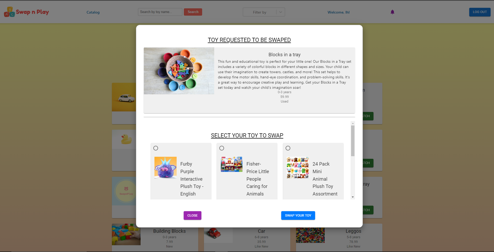

<div style="align: center;">
  <h1>SwapnPlay</h1>
  
</div>

## :rocket: Deployment

Our app is live! Please click the link to check it out [SwapnPlay](https://swapnplay.netlify.app/).
SwapnPlay is successfully deployed on `Netlify` leveraging its robust hosting capabilities. This involved configuring deployment settings, managing environment variables, and implementing continuous integration/continuous deployment (CI/CD) pipelines to streamline the development workflow. On the backend, we utilized `Render` as the hosting platform, harnessing its container-based architecture to deploy and manage microservices seamlessly and for data management, I integrated `ElephantSQL` as the relational database provider.

## :seedling: Contributors

[Hamanpreet Kaur](https://github.com/hamanpreet?tab=repositories) |
[Madiha Waqar](https://github.com/madiha-waqar?tab=repositories) |
[Oluwagbenga Ogundare](https://github.com/codewithevolg?tab=repositories) |

Please don't hesitate to reach out or connect with us! We welcome your feedback on our app and would be delighted to engage with developers who share similar interests.

## :gem: Idea & Energy Behind SwapnPlay
We are excited to introduce you to `SwapnPlay`.

_We live in a world of consumerism and over buying stuff! Our homes and our minds are stressed over decluttering and finding more space. As responsible parents, we want to teach our kids about simple joys of life, to be more mindful of their spending, learn to share and let go and to experience the feeling that the same toy that is eating dust somewhere in a closet is capable of bringing so much excitement to another child!
So, this app is our way to step in the right direction. 
Because its free, it brings happiness, and its environmentally friendly!_

## :books: Tech Stack
**SwapnPLay** is a _full-stack application_ which uses `PERN` stack. `PostgreSQL` as relational database system,  `Node.js` & `Express.js` at backend and `React.js` frameworks for front end. Front-end has been build using `Material UI`.

<p align="center">
  <a href="https://skillicons.dev">
    
  </a>
</p>

In addition to PERN stack we have also utilized following technoligies to enhance the functinlaity of SwapnPlay. We have used `Cloudinary API` for images uploading, `OpenAI` to generate enhanced toy descriptions, `Auth0` for seamless login/logout, `Swagger` for API documentation and `Socket.IO` for Chat feature.

<div style="align: center;">


</div>

## :triangular_flag_on_post: Requirements & Use Cases 
- Requester should be able to sign in/sign out
- User should be able to update their profile
- User should be able to upload profile image
- Requester should be able to create, edit, delete and view toys and toy images
- When creating a toy, toy descriptions should be auto-generated by AI
- Requester should be able to search for toys
- Requester can request a toy.
- Requester should be able to filter based on age group and condition of toy
- Owner should be able to accept or decline toy requests
- Requester should be able to cancel the request
- Match is successfully created if owner accepts request
- Toy should not be swapped if owner declines request
- Requester should get notification on their notification badge when request is received
- Requester should be able to see his history of toy swaps
- Anyone can see a list of all the toys on the app
- Both users should be able to chat on the app
- Requester can click on a toy go on the detail page

## :link: App Feature Screenshots
- Landing Page


- Login Page


- Use Profile 


- Use Profile and User Toys


- Use Profile Toys Update


Create New Toy


Create New Toy > Upload Image through Cloudinary


List of All Toys


Create Swap Request


Request Notification Badge Displays Count OF New Requests


Request Can Be Accepted, Declined or Cancelled


Users Sent & Received Request History Is Displayed


Live Chat Between Against Successfull Swap Match


## :traffic_light: Dependencies
```
    "axios": "^0.18.0",
    "config": "^3.3.9",
    "cors": "^2.8.5",
    "debug": "^4.3.4",
    "dotenv": "^16.3.1",
    "express": "^4.18.2",
    "morgan": "^1.10.0",
    "openai": "^3.1.0",
    "pg": "^8.11.3",
    "socket.io": "^4.7.2",
    "swagger-jsdoc": "^6.2.8",
    "swagger-ui-express": "^5.0.0",
    "node-sass": "^7.0.3",
    "react": "^18.2.0",
    "react-dom": "^18.2.0",
    "react-router-dom": "^6.17.0",
    "react-scripts": "5.0.1",
    "react-select": "^5.7.7",
    "socket.io-client": "^4.7.2",
    "web-vitals": "^2.1.4"
    "@auth0/auth0-react": "^2.2.1",
    "@cloudinary/react": "^1.11.2",
    "@cloudinary/url-gen": "^1.12.0",
    "@emotion/react": "^11.11.1",
    "@emotion/styled": "^11.11.0",
    "@mui/icons-material": "^5.14.14",
    "@mui/material": "^5.14.14",
    "@mui/system": "^5.14.14",
    "@testing-library/jest-dom": "^5.17.0",
    "@testing-library/react": "^13.4.0",
    "@testing-library/user-event": "^13.5.0",
  
  ```
## :clap: Thank you for your interest!
Working on SwapnPlay was an undeniably awesome experience. Throughout the project, we gained a tremendous amount of knowledge about frontend-backend integration with a database and honed our skills in group collaboration, from the initial planning stages to the final presentation. This application undoubtedly boosted our confidence to venture into new territories and create even more exciting apps!
Thankyou for visiting!

------------------------------------------------------------------------------------------------